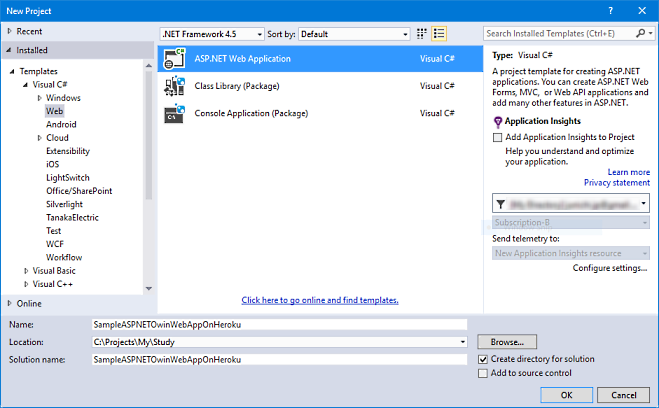
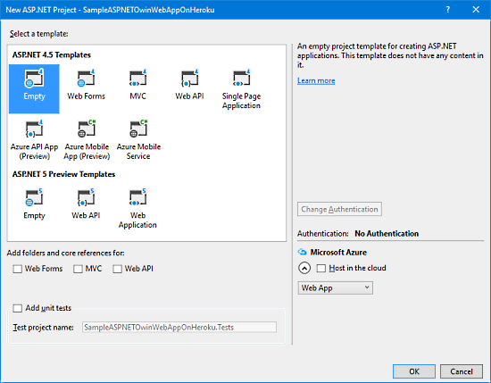
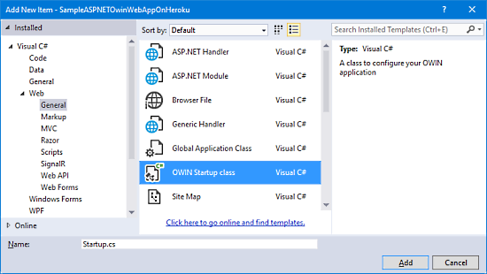

# Owin Host for Heroku

[](https://www.nuget.org/packages/OwinHostForHeroku/)

## What's this? / これは何?

"Owin Host for Heroku" is one of the OWIN Self Hosting Console application, but it was optimized for running your ASP.NET Web application on ["Heroku"](https://heroku.com).

"Owin Host for Heroku" は OWIN セルフホストコンソールアプリのひとつですが、ASP.NET Web アプリケーションを ["Heroku"](https://heroku.com) 上で実行する用に最適化されています。

## How to deploy your ASP.NET Web application written by C# to Heroku? / C# で書かれた ASP.NET Web アプリケーションを Heroku に配置するには?

You can develop ASP.NET Web application which will deploy to Heroku with Visual Studio, same as always.

But please remember, the ASP.NET Web application which deployed on Heroku is running on Linux OS + Mono, and OWIN Self Hosting console application.

So, please pay attention following points.

- You can't use C# 6 syntax and features, and "Roslyn" compiler  (at this time).
- You can't use ASP.NET MVC (because it can't run on OWIN based hosting with Non Windows platforms.)

Heroku に配置する ASP.NET Web アプリケーションは、いつもと同じように Visual Studio と共に開発できます。

但し、Heroku に配置された ASP.NET Web アプリケーションは Linux OS と Mono、そして OWIN セルフホストコンソールアプリの上で走ることを覚えておいてください。

そのため、以下の点に注意してください。

- C# 6 の構文と機能、及び "Roslyn" コンパイラは  (現時点では) 使えません。
- ASP.NET MVC は使えません。(ASP.NET MVC は、OWIN に基づき、且つ、非 Windows OS な環境では実行できないため)

### Requirement in this instruction / この説明手順での前提条件

- On Windows OS
- [Visual Studio 2015](https://www.visualstudio.com/products/vs-2015-product-editions) was installed. (can use [Community Edition](https://www.visualstudio.com/products/visual-studio-community-vs).)
- [Git for Windows](https://git-for-windows.github.io/) was installed and it is executable from command prompt.
- [Heroku toolbelt](https://toolbelt.heroku.com/) was installed and it is executable from command prompt.

Of course, you should have been configured `git` and `heroku` command can use (ex. signed in your heroku account).

- Windows OS 上
- [Visual Studio 2015](https://www.visualstudio.com/products/vs-2015-product-editions) がインストールされていること。([Community Edition](https://www.visualstudio.com/products/visual-studio-community-vs) 可)
- [Git for Windows](https://git-for-windows.github.io/) がインストールされ、コマンドプロンプトから実行できること。
- [Heroku toolbelt](https://toolbelt.heroku.com/) がインストールされ、コマンドプロンプトから実行できること。

もちろん、`git` および `heroku` コマンドは使用可能なように構成しておく必要があります (例: heroku アカウントへのサインインなど)。

### Step 1. Develop your ASP.NET Web application with C# based on OWIN / C# で OWIN に基づく ASP.NET Web アプリケーションを開発する

**1-1)**  
Launch Visual Studio 2015, and create new ASP.NET project via .NET Framework 4.5 x ASP.NET "Empty" project template.

Visual Studio 2015 を起動し、.NET Framework 4.5 の ASP.NET "空のサイト" プロジェクトテンプレートから、新規 ASP.NET プロジェクトを作成します。





**1-2)**  
Remove "Roslyn" compiler from the project by enter following commands in Package Manager Console at Visual Studio.

Visual Studio のパッケージマネージャコンソールから以下のコマンドを入力して、"Roslyn" コンパイラをプロジェクトから削除します。

```powershell
PM> Uninstall-Package Microsoft.CodeDom.Providers.DotNetCompilerPlatform
PM> Uninstall-Package Microsoft.Net.Compilers
```

**1-3)**  
[Optional but Recomended] Remove references of following assemblies for avoid build warning of build system on Heroku.

[必須ではないが推奨] Heroku 上のビルドシステムにおけるビルド時警告を避けるため、以下のアセンブリを参照設定から削除します。

- System.Web
- System.Web.ApplicationServices
- System.Web.DynamicData
- System.Web.Entity
- System.Web.Extensions
- System.Web.Services
- System.Web.Abstractions
- System.Web.Routing

**1-4)**  
Install "Microsoft.Owin.Host.SystemWeb" NuGet package into the project by enter following commands in Package Manager Console at Visual Studio.

Visual Studio 上のパッケージマネージャコンソールから以下のコマンドを入力して、"Microsoft.Owin.Host.SystemWeb" NuGet パッケージをプロジェクトに追加します。

```
PM> Install-Package Microsoft.Owin.Host.SystemWeb
```

**1-5)**  
Add OWIN start up class like bellow to the project.

以下のような OWIN start up クラスをプロジェクトに追加します。



```csharp
// Startup.cs
using System;
using System.Threading.Tasks;
using Microsoft.Owin;
using Owin;

[assembly: OwinStartup(typeof(YourAppNameSpace.Startup))]

namespace YourAppNameSpace
{
    public class Startup
    {
        public void Configuration(IAppBuilder app)
        {
            // For more information on how to configure your application,
            // visit http://go.microsoft.com/fwlink/?LinkID=316888
            app.Run(context => context.Response.WriteAsync("Hello World."));
        }
    }
}
```

### Step 2. Make the project ready for Heroku by installing "Owin Host for Heroku" NuGet package / "Owin Host for Heroku" NuGet パッケージを追加して、プロジェクトを Heroku 対応にする

#### [ This is important step / これは重要なステップです ]

Install "OwinHostForHeroku" NuGet package into the project by enter following commands in Package Manager Console at Visual Studio.

Visual Studio 上のパッケージマネージャコンソールから以下のコマンドを入力して、"OwinHostForHeroku" NuGet パッケージをプロジェクトに追加します。

```
PM> Install-Package OwinHostForHeroku
```

### Step 3. Create git local repository and commit the project / git ローカルリポジトリを作成しプロジェクトをコミットする

Open command prompt, and do like this:

コマンドプロンプトを開き、こんな感じで:

```shell
> pushd {solution folder path}
> git init .
> echo *.user > .gitignore
> echo *.suo >> .gitignore
> echo bin/ >> .gitignore
> echo obj/ >> .gitignore
> echo packages/ >> .gitignore
> echo .vs/ >> .gitignore
> git add *
> git commit -m "1st commit."
```

### Step 4. Create Web application site on Heroku / Heroku 上に Web アプリケーションサイトを作る

Open command prompt, and do like this:

コマンドプロンプトを開き、こんな感じで:

```shell
> pushd {solution folder path}
> heroku create
```

### Step 5. Make the Web application site on Heroku available to build C# project / Heroku 上の Web アプリケーションサイトを、C# プロジェクトをビルド可能にする。

#### [ This is important step / これは重要なステップです ]

You should configure "Buildpack" settings of the Web application site on Heroku to use 3rd party buildpack for building C# project.

Heroku 上の Web アプリケーションサイトにおける "ビルドパック" の設定を、C# プロジェクトをビルドする用の 3rd パーティ製ビルドパックを使用するよう構成する必要があります。

Open command prompt, and do like this:

コマンドプロンプトを開き、こんな感じで:

```shell
> pushd {solution folder path}
> heroku config:add BUILDPACK_URL=https://github.com/friism/heroku-buildpack-mono
```

### Step 6. Deploy the project to the Web application site on Heroku by git push. / git の push により、プロジェクトを Heroku 上の Web アプリケーションサイトへ配置

#### [ This is final step / これは最終ステップです ]

Open command prompt, and do like this:

コマンドプロンプトを開き、こんな感じで:

```shell
> pushd {solution folder path}
> git push heroku master
```

After this, enter `> heroku open` command, then Web browser was launched and open the Web site, and you can see "Hello World" in browser.

このあと、`> heroku open` コマンドを入力すると、ブラウザが立ち上がって Web サイトが開き、"Hello World" が表示されます。

### Example / 例

**Chomad Problem Web API Server / ちょまど問題 Web API サーバー**  
[https://github.com/jsakamoto/chomado-problem-server](https://github.com/jsakamoto/chomado-problem-server)

This Web app can deploy by "git push" to Heroku, Azure Web Apps, and AppHarbor.

この Web アプリは、Heroku、Azure Web Apps、そして AppHarbor に "git push" で配置できます。


----
